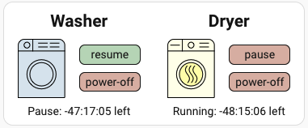

# Basic Laundry Card for thinQ washer and/or dryer

***

* @published: December 2025
* @author: Nelia Mann
* @name: `laundry-card`

## Accepted Devices

- works with LG thinQ washer/dryer
- will work with one or both devices

## Assumed entities

- sensor.device._remaining_time
- sensor.device._current_status
- select.device.operation

In these lines, device must be the entity id (not ideal!)

## Behaviors

- Has a visual editor
- Displays an image of the washer and/or dryer correlating with its current status
- Displays a message giving the current status
- When appropriate (when remaining time is actually defined) displays a regularly updating estimate of the remaining time
- When appropriate (when the device is powered on) displays controls for start/stop and power-off

Above, the goal is to make the start/stop and power-off controls only display when they can actually be used.  Currently, this doesn't
quite do what it's supposed to because it actually just checks device status; it should check whether remote start is enabled.  That's a separate entity.
